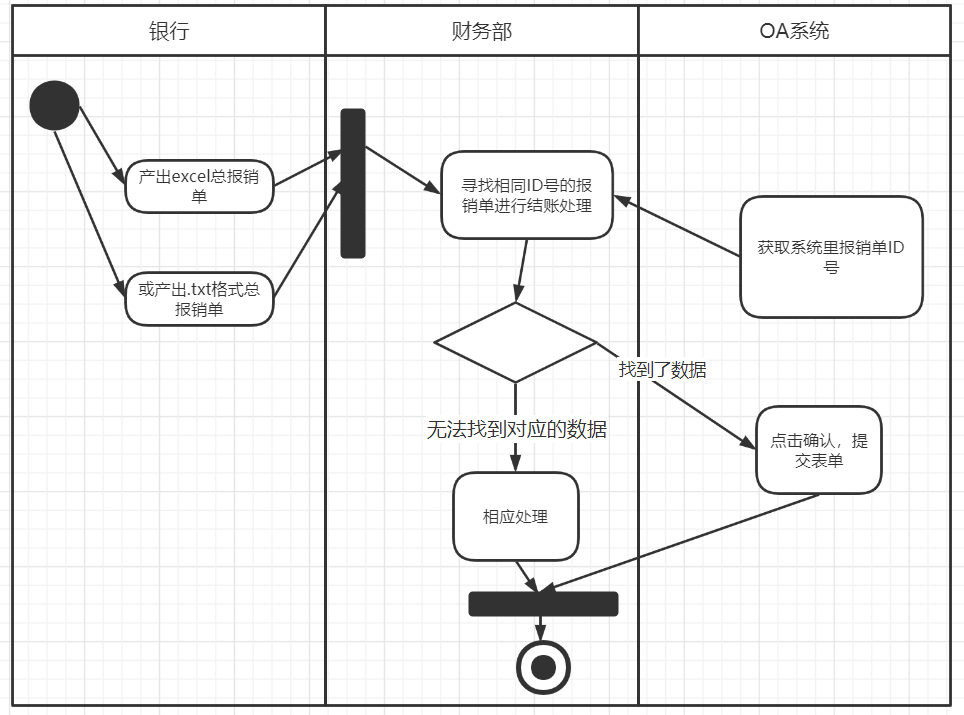
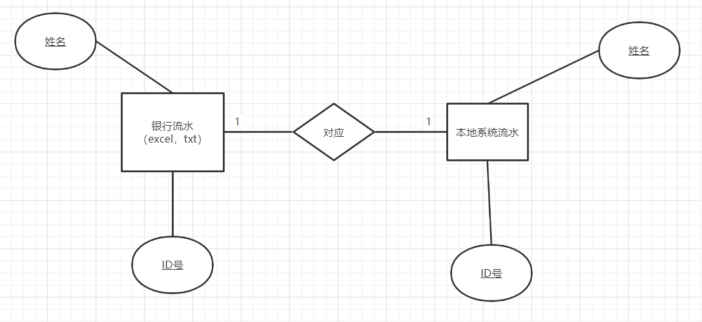

# RPA-In-Financial-Reimbursement
实习的一个项目，实现了公司财务部报销流程的自动化，而且大大提高了流程的速度，大大降低了整个流程的时间复杂度，达到了又快又好的目标。

### 业务活动图



将银行发来的报销流水与本地系统数据库的报销流水进行对账，然后进行相应处理。

### 涉及到的数据对象



### 采用的技术

python的selenium自动化测试框架

### 详细设计：RPA程序流程（图片相关已去除）

1.打开谷歌浏览器并进入OA系统登录页面：

2.填好用户名和密码，模拟点击登录按钮：

3.之后就进入了OA系统首页，模拟点击“审批协同”栏目中的“更多”文字超链接：

4.之后来到了审批页面，模拟鼠标滑动到右上角“查询条件”多选框中：

5.之后，模拟点击选择发起人

6.进入如下页面，接下来去excel里取想要查询的姓名

7.打开事先指定的文件夹中的第一个excel文件,按从上到下的顺序读

取第一个姓名。

8.接下来，把刚才读取的一行数据中的“名称”那一列的文字输入到输入框中。

9.接来下，模拟点击输入框右边的搜索小图标。得到如下页面：

10.先判断该单子是否为报销单，

​	若不是，直接跳过。

​	若是，则

​		模拟点击第一行事项，来到如下页面：

​		11.接下来核对编号，

​		如果在那个excel表中，那个姓名下

​                                   有这个编号，则模拟点击是和同意，如图所示：然后模拟点击提交

​                                   否则：生成一个“系统里有表里没有”的txt文件做下记录。

依次循环，直到该姓名找完，若excel里该姓名下还有刚才未去找的编号，则生成一个“表里有系统没有”的txt文件做下记录。

然后系统又来到步骤9中所示页面

此时只需要再从excel表中读入下一个姓名即可

直到读完excel所有数据

再到下一个excel。

 

备注：

若是天津百融txt文件，按照excel字段顺序生成excel文件

Excel表头为状态那一列，若为“成功”字段，则继续执行。否则跳过这一行数据。

Txt文件里默认全部是成功的

 

要求：

1.在运行程序前先关闭小喇叭所有的通知
2.运行后，一开始除了关闭一些必要的东西之后，就不要再动鼠标，直至程序完成（这里可以现场演示）

3.Excel文件格式按招商银行的格式，且第一行为表头

### 解决的问题

公司财务部（包括其他部门）往往有一些重复性的工作，主要表现特点为：重复性的鼠标点击，键盘输入。那么就可以用程序来代替人工。**但仅仅是代替人工，那价值甚小，应该要比人做得更快更好，能处理更复杂的事**，这也是本项目的出发点。解决的问题：

1.代替人工

2.在对账时能自动记录两边流水不对应的情况

3.“找”的速度更快

​	一般财务人员是这样找的：先打开excel，查看第一行数据，去网站系统搜索姓名，再查看该姓名下的哪个单子的ID号与第一行数据对应。

​	财务老手：在搜索名字后，一眼就能找到哪个单子是对应的单子（根据单子时间与流水的发送的时间等等经验）。

​	我的做法：先提前将excel预处理，用一个哈希表来存储excel数据，其中key值为每个姓名，value值为ID号的链表

```python
{per_name:[ID1,ID2,ID3...]}
```

这样每个excel就是一个哈希表，那么一个文件夹下的所有excel（txt根据格式转为excel）最终生成一个大链表

```python
[{:},{:},{:}...]
```

这样按顺序从第一个哈希表来进行对账流程，在系统搜索第一个姓名，点击第一个单子，若该单子的ID号在value链表里，则为“找到了”，点击“是“，”同意“，”提交“，即处理单子，最后将该值从链表里remove，直到该姓名搜索完，若链表里还有值，即为excel表里有但系统没有的情况。若该单子的ID号不在value链表里，即为系统有excel表里没有的情况。

***算法分析：***

假设有n个姓名，每个姓名有n条数据。

一般财务人员：最坏情况下，一个姓名找n+n-1+n-2+...+1<=n^2次，每次查找时间复杂度为O(n)，查找完一个姓名所需要找的次数约等于n^2次，即O(n^2)，全部完成，显然，为O(n^3)

财务老手：不好评价

我的做法：找每条数据都是1次的，即O(1),查找完一个姓名次数为n次，即O(n)，全部完成，为O(n^2)

|              | 一般财务人员 | 我的做法 |
| ------------ | :----------: | :------: |
| 查找一条数据 |     O(n)     |   O(1)   |
| 找完一个姓名 |    O(n^2)    |   O(n)   |
| 全部找完     |    O(n^3)    |  O(n^2)  |

## 测试

630行数据，花了86分钟，平均8.2秒/行。

### 存在的问题

***程序鲁棒性：***

程序运行中影响因素较多，比如

1.网络突然没网或变慢，网站突然卡顿，请求响应不及时，导致无法及时加载元素，从而无法获取元素而报错。

2.页面有办公消息弹窗，同时偶尔弹出广告，影响“点击”操作

### ***解决方案：***

尽量选择一个稳定高速的网络环境，如果公司网络欠佳，可用手机开热点+连内网VPN的形式。同时所涉及的网页以文字内容为主，所耗流量相对来说是较少的。

运行前，关闭办公提醒功能。

由于网络和广告弹窗的不确定性，我做了一个进程阻塞，即“暂停”功能，当程序因为网络，广告原因无法正常获取元素时，会弹出一个I/O窗口：提示框，即“暂停”程序（请把电脑声音打开，以便能听到提示音），请**先手动关闭广告，若是网络问题，等待网络恢复，再点击按钮，继续上一轮操作即可**。若等了一会，仍然在转圈圈，说明网中间断开过，则需要重新加载网页，请记住当前的状态，什么姓名，第几条，第几页，刷新后手动恢复之前状态，这样的代价是会跳过当前单子，因为刷新，程序已获取的状态没有保存了，只能从下一条开始，这样的情况很少见。

若网络环境确实糟糕，出现断网等状况，会跳过一行数据，但会记录下来，程序结束后人工结束单子即可，这从效率来看是无伤大雅的。
